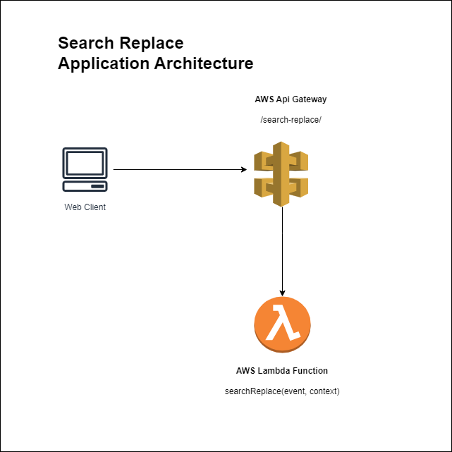
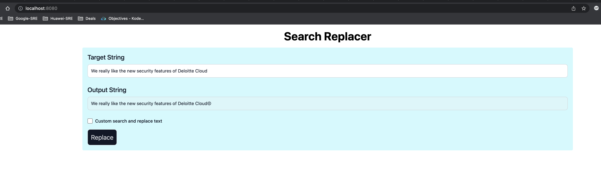

# Search Replacer

## Problem
```
Build an API that will use a string as input and does a find and replace for certain words and outputs the result. For example: replace Google for
Google©.

Example input: “We really like the new security features of Google Cloud”

Expected output: “We really like the new security features of Google Cloud©”

The words that need to be replaced are listed below:

Oracle -> Oracle©

Google -> Google©

Microsoft -> Microsoft©

Amazon -> Amazon©

Deloitte -> Deloitte©


Author: Arvind Lavania
Date: 22-Nov-2022
```

## Quick Overview
I am designing this in AWS Cloud. Below Tech i will use to solve this problem.
1. AWS CLI
2. AWS SAM
3. AWS IAM
3. AWS Cloudformation
4. AWS API Gateway
5. AWS Lambda
6. NPM Webserver (opensource)
7. Python 3.9

## Architecture



## Setup Instructions

1. Download aws cli from here: https://docs.aws.amazon.com/cli/latest/userguide/getting-started-install.html

2. Download aws sam cli from here: https://docs.aws.amazon.com/serverless-application-model/latest/developerguide/install-sam-cli.html#install-sam-cli-instructions

3. Check if aws cli and sam cli are installed by the following: 
```
aws --version
sam --version
```


4. Create iam user and configure aws cli with `aws configure`

5. Please clone the source code and IDE

6. To build app, use sam build

7. to locally run the lambda functin run `sam build && sam local invoke SearchReplace --event events\success.json` (for this you should have docker installed)

8. to deploy run `sam build && sam deploy` (if for the first time, run sam deploy --guided)

9. For frontend, you have to setup a local http server with this `npm install --global http-server` (refer https://www.npmjs.com/package/http-server)

10. Once the server is installed, run `http-server frontend --port=8080` from the project root and visit http://localhost:8080

## WEB Page



## Important Links
1. Aws cli: https://aws.amazon.com/cli/
2. Aws Sam: https://aws.amazon.com/serverless/sam/
4. Http Server: https://www.npmjs.com/package/http-server
5. Advance Arch diagram also attached. 


